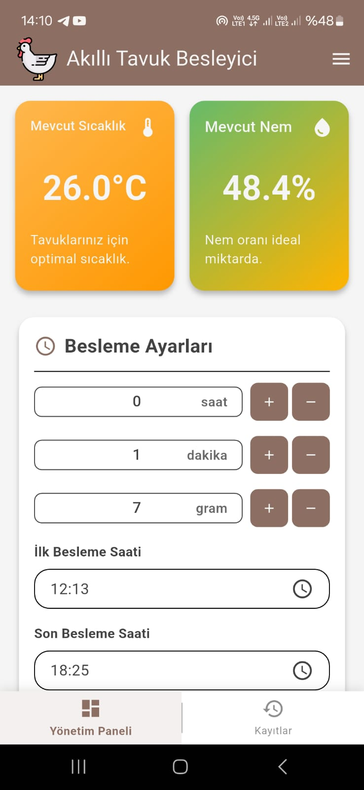
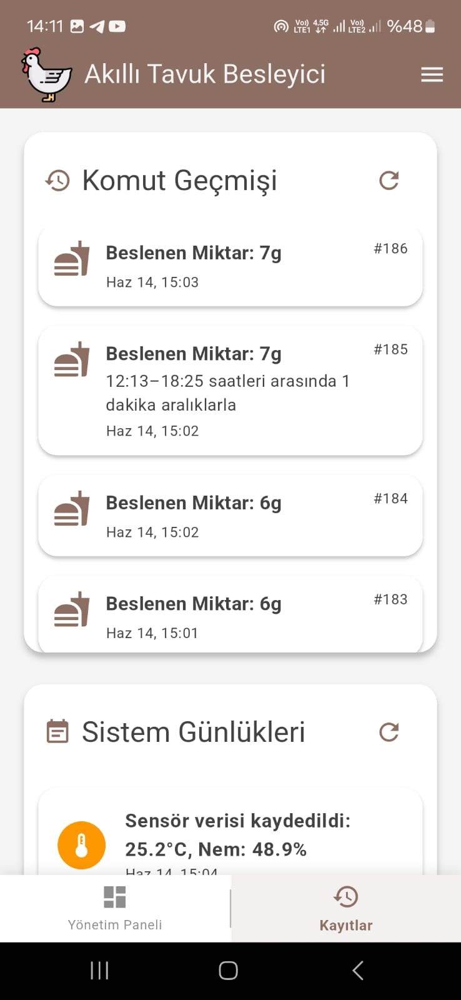

**Smart Feeding App — Mobil Kontrol Uygulaması**

Bu repo, bir IoT besleyici cihazını mobilden kontrol etmek için hazırlanmış Flutter tabanlı mobil/web uygulamasını içerir. Uygulama, cihaz durumunu izleme, besleme zamanlamaları oluşturma, sensör verilerini görselleştirme ve bildirim/uzaktan komut gönderme gibi işlevleri destekler.

**Proje Özeti:**
- **Amaç:** IoT besleme cihazlarını uzaktan yönetmek ve sensör verilerini takip etmek.
- **Platform:** Flutter (mobil ve web uyumlu). Ana giriş: `lib/main.dart`.
- **API & Haberleşme:** `lib/services/feeder_api.dart`, `lib/services/websocket_service.dart`, `lib/services/firebase_messaging_handler.dart`.
- **Durum Yönetimi:** `lib/bloc/` ve `lib/bloc/*_cubit.dart` ile uygulama durumu yönetiliyor.
- **Dil ve Lokalizasyon:** `lib/generated/l10n.dart` ve `lib/l10n/` dosyaları ile çokdil desteği (Türkçe/İngilizce).

**Öne Çıkan Özellikler**
- Besleme zamanlayıcıları ve ayarları (`lib/widgets/feed_settings/`, `lib/widgets/feed_setting.dart`).
- Sensör verilerini görüntüleme ve geçmiş logları (`lib/modals/system_log.dart`, `lib/widgets/sensor_widgets/`).
- Canlı bağlantı (WebSocket) ve anlık bildirim desteği (Firebase Messaging).
- Responsive tasarım: `lib/widgets/responsive_layout.dart`, `lib/pages/mobile_screen.dart`, `lib/pages/web_screen.dart`.

<!-- Kurulum ve çalıştırma yönergeleri isteğe bağlı olarak projeden kaldırıldı. README yalnızca proje amacı, özellikleri ve mimari bilgilerini içerir. -->

**Proje Mimarisi & Önemli Noktalar**
- `lib/services/feeder_api.dart`: REST/HTTP üzerinden besleyiciye komut göndermek için kullanılır.
- `lib/services/websocket_service.dart`: Cihazdan anlık veri almak / push komutları için WebSocket bağlantısı yönetimi.
- `lib/bloc/`: Uygulamanın ana mantık katmanı — UI ile servisler arasındaki köprü.
- `lib/modals/`: API yanıt modelleri ve uygulama içi veri yapılandırmaları.

**Ekran Görüntüleri**
Uygulamanın ekran görselleri aşağıdadır:

- Ana Ekran
  

- Loglar / Geçmiş
  

**Rapor Özeti**
- Proje, akademik bir bitirme projesi kapsamında geliştirilmiş olup amaç IoT cihaz kontrolünü mobil arayüz ile sağlamaktır.
- Sistemde cihaz yönetimi, zamanlanmış beslemeler, sensör verisi kayıtları ve uzaktan komut yetenekleri mevcuttur.
- Raporun detaylarında uygulamanın test senaryoları, kullanılan donanım (besleyici) ve iletişim protokolleri açıklanmıştır — gerektiğinde raporun ilgili bölümleri README'a genişletilebilir.

---

# 🐾 Smart Feeding App - IoT Feeder Controller

A Flutter-based application for controlling IoT smart chicken feeders via WebSocket. Built with robust state management using the **Bloc pattern**, this app offers real-time monitoring, multi-language support, and theme customization.

## 🌟 Features

### 🎛️ Feeding Control
- Adjust feeding schedules in real-time through WebSocket communication.
- Dynamically update feeding frequency without device reboot.

### 📜 Real-Time Logs
- Stream system logs and feeding events directly to the app.
- Filter logs by type (info, warning, error) for quick diagnostics.

### 🌡️ Temperature Monitoring
- Live ambient temperature display with color-coded thresholds:
  - **Safe Range**: 15°C - 25°C (59°F - 77°F)
  - **Critical**: Push notifications when exceeding limits
- Historical temperature graph (last 24 hours)

### 📦 Technologies Used

- **Flutter**  
- **WebSocket** for real-time communication  
- **intl** for localization  🌐
- **Bloc** for state management  
- **flutter_localizations** for multi-language support  
